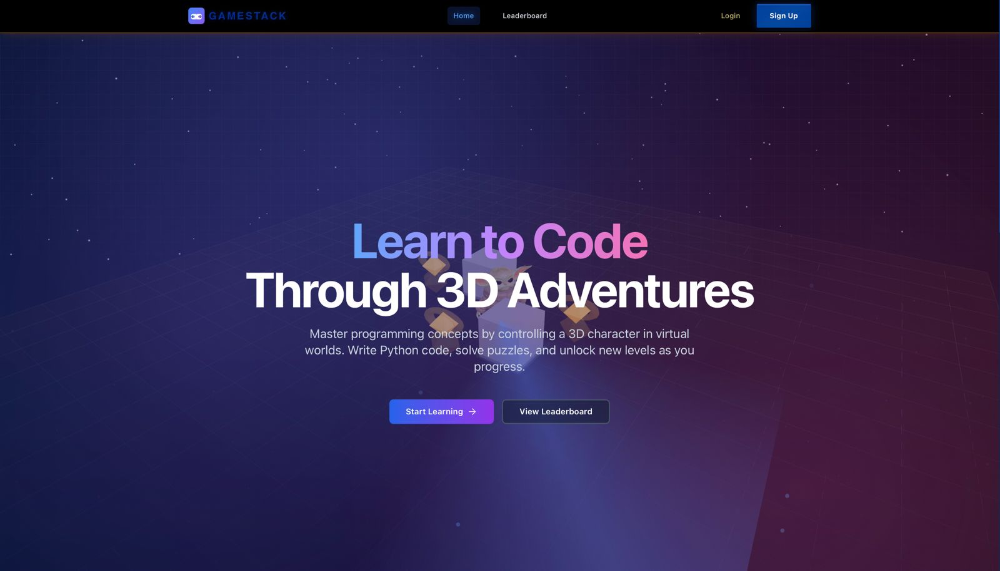
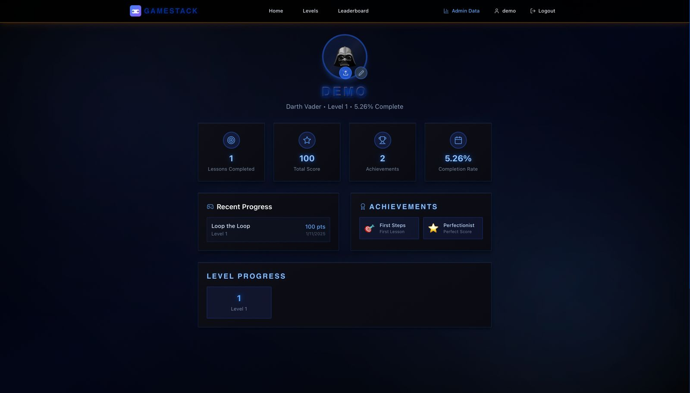
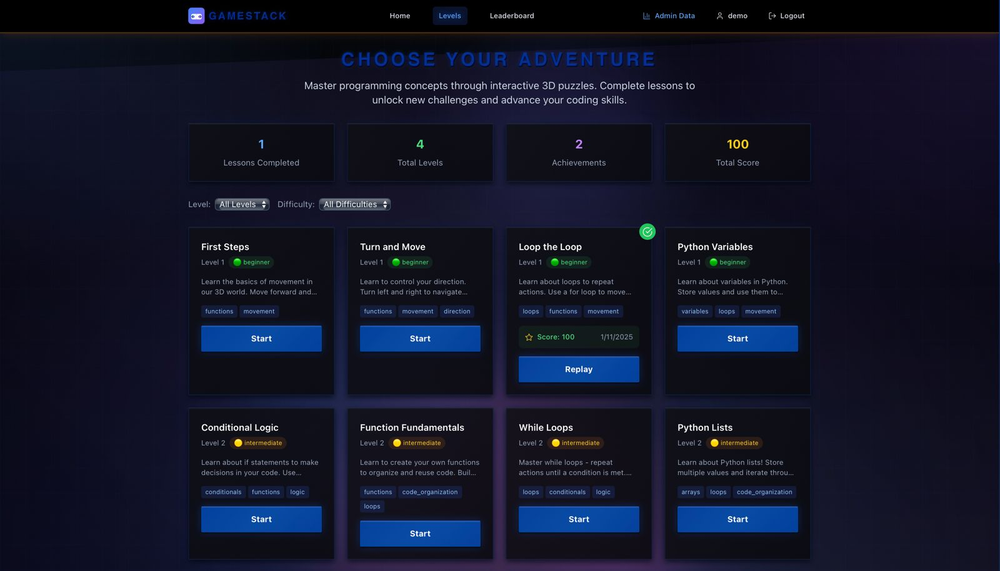
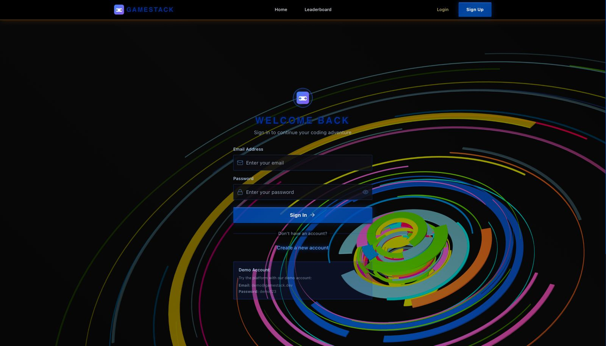
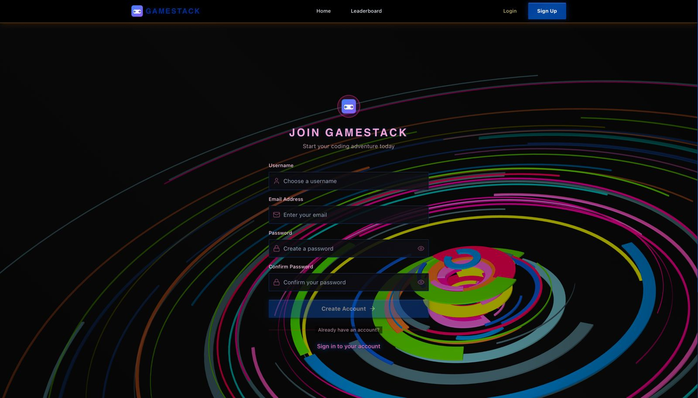
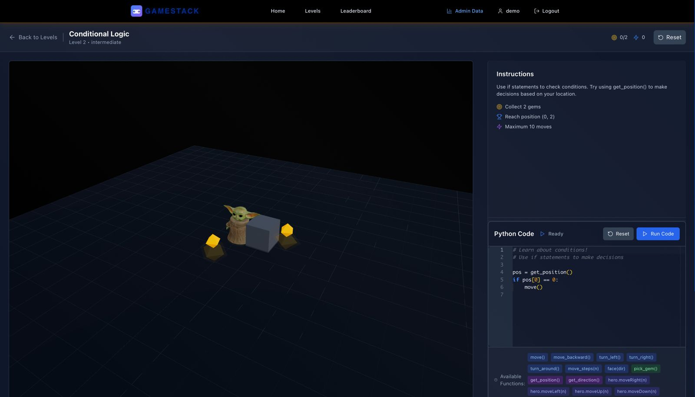
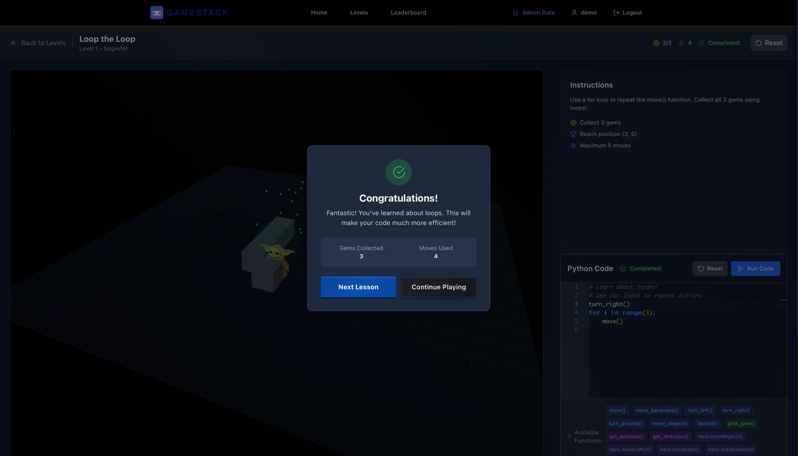
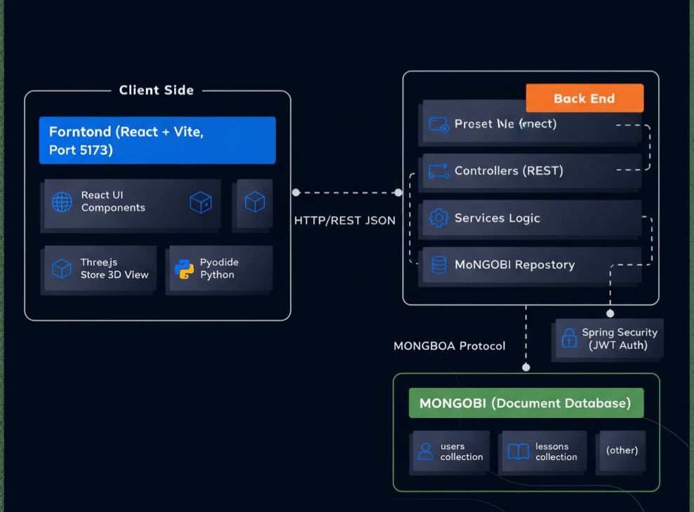
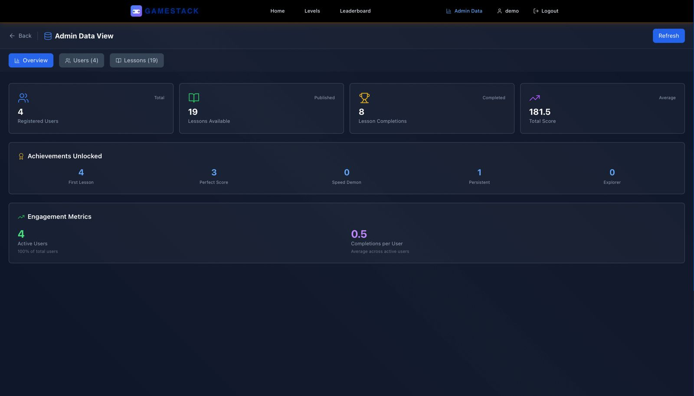

# GameStack 🎮

A gamified code learning platform inspired by Apple's Swift Playgrounds. Learn programming through interactive 3D visual feedback by controlling a character in virtual worlds.


*Welcome to GameStack - Learn to code through 3D adventures*

## 🚀 Features

- **3D Interactive Learning**: Control a 3D character through Python code
- **Real-time Code Execution**: Write and run Python code in the browser using Pyodide
- **Progressive Difficulty**: Learn from beginner to advanced programming concepts
- **Achievement System**: Unlock achievements and track your progress
- **Leaderboards**: Compete with other learners worldwide
- **Monaco Editor**: Professional code editing experience with syntax highlighting
- **Responsive Design**: Works on desktop, tablet, and mobile devices
- **Admin Dashboard**: Web interface for viewing and managing data
- **User Authentication**: Secure JWT-based authentication system


*User profile dashboard showing progress, achievements, and statistics*

## 🛠️ Tech Stack

### Frontend
- **React** with Vite for fast development
- **React Three Fiber** + **Three.js** for 3D graphics
- **Monaco Editor** for code editing
- **Zustand** for state management
- **TailwindCSS** for styling
- **React Router** for navigation
- **Pyodide** for Python code execution
- **Framer Motion** for animations

### Backend
- **Spring Boot 3.2** with Java 17
- **Spring Data MongoDB** for database operations
- **MongoDB** as the primary database
- **JWT** authentication with Spring Security
- **RESTful API** design
- **CORS** configuration for cross-origin requests
- **Spring Mail** for email functionality (optional)

## 📦 Installation

### Prerequisites
- **Node.js** (v16 or higher) for frontend
- **Java 17** or higher for backend
- **Maven 3.6** or higher for backend
- **MongoDB** (running locally or remote connection string)
- **npm** or **yarn** for frontend package management

### Setup

1. **Clone the repository**
   ```bash
   git clone https://github.com/yourusername/gamestack.git
   cd gamestack
   ```

2. **Start MongoDB**
   
   Make sure MongoDB is running on your machine:
   ```bash
   # On macOS with Homebrew
   brew services start mongodb-community
   
   # On Linux
   sudo systemctl start mongod
   
   # Or use Docker
   docker run -d -p 27017:27017 --name mongodb mongo
   ```

3. **Install and run backend**
   ```bash
   cd backend-spring
   mvn clean install
   mvn spring-boot:run
   ```
   
   The Spring Boot backend will:
   - Start on http://localhost:3001
   - Connect to MongoDB at `mongodb://localhost:27017/gamestack`
   - Create collections automatically
   - API available at http://localhost:3001/api

4. **Install frontend dependencies**
   ```bash
   cd frontend
   npm install
   ```

5. **Start the frontend**
   ```bash
   cd frontend
   npm run dev
   ```

   The frontend will start on http://localhost:5173

## 🎮 Usage

1. **Visit the application**: Open http://localhost:5173


*Choose your adventure - Browse and select programming lessons by level and difficulty*

2. **Create an account**: Register with username, email, and password


*Login page with demo account credentials*


*Create your account to start coding*

3. **Start learning**: Choose a level and begin coding!
4. **Write Python code** to control your 3D character
5. **Collect gems** and complete objectives
6. **Unlock achievements** and climb the leaderboard
7. **View admin data**: Visit http://localhost:3001/view (for admin users)


*Interactive 3D game world with Python code editor*


*Congratulations modal after completing a lesson*

## 🎯 Available Functions

In the game environment, you have access to these Python functions:

- `move()` - Move forward one step
- `turn_left()` - Turn 90 degrees left
- `turn_right()` - Turn 90 degrees right
- `pick_gem()` - Pick up a gem at current position
- `get_position()` - Get current x, z coordinates
- `get_gems_collected()` - Get number of gems collected
- `get_moves()` - Get current move count

## 📚 Learning Path

### Level 1: Basics
1. **First Steps** - Learn basic movement
2. **Turn and Move** - Master direction control
3. **Loop the Loop** - Introduction to loops

### Level 2: Intermediate
1. **Conditional Logic** - If statements and decision making
2. **Function Fundamentals** - Creating your own functions

### Level 3: Advanced
1. **Complex Navigation** - Advanced pathfinding
2. **Algorithm Design** - Efficient solutions
3. **Creative Challenges** - Open-ended problems

## 🏛️ Architecture

GameStack follows a modern three-tier architecture, separating the frontend, backend, and database layers.


*System architecture: React frontend communicates with Spring Boot backend via REST API, which connects to MongoDB database*

For a detailed breakdown, refer to the [ARCHITECTURE.md](ARCHITECTURE.md) file.

## 🔧 Development

### Project Structure
```
gamestack/
├── frontend/              # React frontend
│   ├── src/
│   │   ├── components/    # React components
│   │   │   ├── 3d/       # 3D scene components
│   │   │   ├── auth/     # Authentication components
│   │   │   ├── editor/   # Code editor components
│   │   │   └── layout/   # Layout components
│   │   ├── pages/         # Page components
│   │   ├── store/         # Zustand stores
│   │   ├── utils/         # Utility functions
│   │   └── App.jsx        # Main app component
│   ├── public/            # Static assets
│   ├── vite.config.js     # Vite configuration
│   └── package.json
├── backend-spring/        # Spring Boot backend
│   ├── src/main/java/com/gamestack/
│   │   ├── controller/    # REST controllers
│   │   ├── entity/        # MongoDB document entities
│   │   ├── repository/    # MongoDB repositories
│   │   ├── service/       # Business logic
│   │   ├── security/      # JWT & security config
│   │   └── config/        # Configuration classes
│   ├── src/main/resources/
│   │   ├── application.yml # Application configuration
│   │   └── static/        # Static web interface
│   └── pom.xml
├── images/                # Screenshots and images for README
├── ARCHITECTURE.md        # Detailed architecture documentation
└── README.md
```

### API Endpoints

#### Authentication
- `POST /api/auth/register` - Register new user
- `POST /api/auth/login` - Login user
- `GET /api/auth/me` - Get current authenticated user
- `PUT /api/auth/profile` - Update user profile

#### Lessons
- `GET /api/lessons` - Get all lessons
- `GET /api/lessons/:id` - Get specific lesson by ID
- `POST /api/lessons` - Create new lesson (Admin only)
- `PUT /api/lessons/:id` - Update lesson (Admin only)
- `DELETE /api/lessons/:id` - Delete lesson (Admin only)
- `POST /api/lessons/:id/complete` - Mark lesson as completed
- `GET /api/lessons/:id/progress` - Get user's progress for a lesson

#### Users
- `GET /api/users/profile` - Get user profile (Authenticated)
- `GET /api/users/progress` - Get user progress and statistics
- `GET /api/users/achievements` - Get user achievements

#### Leaderboard
- `GET /api/leaderboard` - Get leaderboard rankings
- `GET /api/leaderboard/my-position` - Get current user's position

#### Admin (Admin role required)
- `GET /api/admin/stats` - Get admin statistics
- `GET /api/admin/users` - Get all users
- `GET /api/admin/lessons` - Get all lessons with admin details


*Admin panel showing all lessons with details*

#### Data Sync
- `POST /api/sync/all` - Synchronize all data (Manual sync)
- `GET /api/sync/statistics` - Get sync statistics

#### Health
- `GET /api/health` - Health check endpoint
- `GET /` - API information endpoint

#### Web Interface
- `GET /view` - Redirect to data viewing interface
- `GET /data-view.html` - Static HTML interface for viewing data

### MongoDB Collections

The application uses the following MongoDB collections:
- `users` - User accounts and progress
- `lessons` - Lesson definitions and world states
- `otps` - One-time passwords (if email OTP is enabled)

### Configuration

#### Backend Configuration (`backend-spring/src/main/resources/application.yml`)

```yaml
server:
  port: 3001

spring:
  data:
    mongodb:
      uri: mongodb://localhost:27017/gamestack
      auto-index-creation: false
  
  security:
    jwt:
      secret: your_jwt_secret_key_here
      expiration: 604800000 # 7 days
```

#### Environment Variables

You can override configuration using environment variables:
- `MONGODB_URI` - MongoDB connection string
- `JWT_SECRET` - JWT signing secret
- `PORT` - Server port (default: 3001)
- `MAIL_USERNAME` - Email username (for email features)
- `MAIL_PASSWORD` - Email password (for email features)

### Adding New Lessons

To add lessons, you can:

1. **Use the Admin API**: POST to `/api/lessons` with admin JWT token
2. **Use MongoDB directly**: Insert documents into the `lessons` collection
3. **Use the web interface**: Visit http://localhost:3001/view (admin users)

Required fields for a lesson:
```json
{
  "title": "Lesson Title",
  "description": "Lesson description",
  "instructions": "What the user should do",
  "level": 1,
  "difficulty": "beginner",
  "concepts": ["loops", "conditionals"],
  "worldState": {
    "player": { "position": { "x": 0, "z": 0 }, "rotation": { "y": 0 } },
    "gems": [],
    "obstacles": []
  },
  "targetState": {
    "gemsCollected": 1,
    "maxMoves": 10
  },
  "published": true
}
```

## 🚀 Building for Production

### Frontend Build
```bash
cd frontend
npm run build
```

The production build will be in the `frontend/dist` directory.

### Backend Build
```bash
cd backend-spring
mvn clean package -DskipTests
```

The JAR file will be in `backend-spring/target/gamestack-backend-1.0.0.jar`

Run the JAR:
```bash
java -jar target/gamestack-backend-1.0.0.jar
```

## 🔐 Security

- JWT-based authentication
- Password encryption using BCrypt
- CORS configuration for allowed origins
- Role-based access control (Admin/User)
- Secure HTTP headers via Spring Security

## 📖 Documentation

- [ARCHITECTURE.md](ARCHITECTURE.md) - Detailed system architecture documentation

## 📸 Screenshots

The README includes screenshots located in the `images/` directory. To display these images:

1. Create an `images/` folder in the root of your repository
2. Add the following image files:
   - `landing-page.png` - Landing page screenshot
   - `architecture-diagram.png` - System architecture diagram
   - `user-dashboard.png` - User profile dashboard
   - `levels-select-page.png` - Lesson selection page
   - `login-page.png` - Login page with demo credentials
   - `signup-page.png` - Registration page
   - `gameplay-code-editor.png` - Interactive 3D game with code editor
   - `lesson-complete.png` - Lesson completion modal
   - `admin-data-view.png` - Admin panel showing lessons

Alternatively, you can host these images on a CDN or image hosting service and update the image paths in this README accordingly.

## 🤝 Contributing

1. Fork the repository
2. Create a feature branch: `git checkout -b feature/amazing-feature`
3. Commit your changes: `git commit -m 'Add amazing feature'`
4. Push to the branch: `git push origin feature/amazing-feature`
5. Open a Pull Request

## 📄 License

This project is licensed under the MIT License - see the [LICENSE](LICENSE) file for details.

## 🙏 Acknowledgments

- Inspired by Apple's Swift Playgrounds
- Built with amazing open-source libraries
- 3D graphics powered by Three.js and React Three Fiber
- Python execution in browser thanks to Pyodide

## 📞 Support

If you encounter any issues or have questions:

1. Check the [Issues](https://github.com/yourusername/gamestack/issues) page
2. Create a new issue with detailed information
3. Join our community discussions

---

**Happy Coding! 🎮✨**

